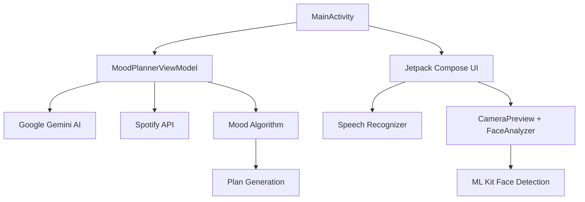

<p align="center">
  
</p>

<h1 align="center">Moodİİ — WakeMood Planner</h1>

<p align="center">
  <b>AI-Powered Morning Mood Analyzer & Personalized Daily Planner</b>
</p>

<p align="center">
  
  
  
  
  
  
  
  
</p>

---

## 📖 Overview

**Moodİİ (WakeMood Planner)** is an intelligent Android application that analyzes the user's morning mood through multiple input channels — **facial expression scanning**, **voice input**, and **alarm snooze count** — and generates a personalized, AI-powered daily action plan using **Google Gemini AI**. It also integrates with **Spotify** to create mood-based playlists, turning each morning into a tailored productivity experience.

The application adapts its plan generation to the user's **profession** (Student, Software Developer, Doctor, Teacher, Artist, or Other) and **specific situational context** (upcoming exams, project deadlines, shifts, events, etc.), ensuring plans are not just mood-appropriate but also contextually relevant.

---

## ✨ Key Features

### 🧠 Multi-Modal Mood Analysis
- **Facial Expression Scanning** — Uses CameraX + ML Kit Face Detection to measure smile probability in real-time with face contour and landmark overlays
- **Voice Input** — Turkish-language speech recognition that parses sentiment keywords (e.g., "harika", "yorgunum", "sinirliyim") to gauge emotional state
- **Alarm Snooze Tracking** — User reports how many times they snoozed their alarm, factoring into mood calculation
- **Composite Mood Scoring** — All three inputs are combined into a weighted mood score that maps to one of four mood categories

### 🎭 Four Mood Categories
| Mood | Description | Effect |
|------|-------------|--------|
| 💪 **ENERGETIC_READY** | High energy, ready for intensive tasks | Intensive task scheduling |
| 😴 **SLEEPY_TIRED** | Slow start mode | Gentle, gradual task flow |
| 🧘 **GRUMPY_STRESSED** | Meditation + simple tasks mode | Stress-relief focused plan |
| 🙂 **NEUTRAL** | Standard plan mode | Balanced daily plan |

### 👤 Profession-Specific Planning
- **Student** — Exam schedule input, study plan generation with Pomodoro/Feynman techniques, exam-day detection
- **Software Developer** — Project deadline tracking, code review blocks, learning sessions
- **Doctor** — Shift/on-call schedule awareness, rest planning, patient case prep
- **Teacher** — Lesson plan prep, grading sessions, parent meeting scheduling
- **Artist** — Exhibition/event deadlines, creative inspiration blocks, portfolio work

### 🤖 Google Gemini AI Integration
- **Gemini 2.0 Flash** model for fast, context-aware plan generation
- Dynamically constructed prompts incorporating user profile, mood, profession, time of day, and specific context
- Expandable task cards with AI-generated sub-tasks on demand
- Fallback task system when API is unavailable

### 🎵 Spotify Integration
- **OAuth 2.0 with PKCE** for secure authentication via AppAuth library
- AI-generated song recommendations based on mood and profession
- Automatic playlist creation on user's Spotify account
- Track search, playlist assembly, and direct Spotify app launch

### 🔐 User Session & Navigation
- 10-screen flow with animated transitions (AnimatedContent)
- Back navigation with context-aware routing
- Login system with user/password
- Full reset and new-day analysis capabilities

---

## 🏗️ Architecture

```
MVVM (Model-View-ViewModel) — Single Activity Architecture
```



### Core Components

| Component | File | Responsibility |
|-----------|------|----------------|
| **Main Activity** | `MainActivity.kt` | Activity entry, Spotify auth handling, navigation host |
| **ViewModel** | `MoodPlannerViewModel.kt` | Business logic, state management, AI calls, Spotify API |
| **Camera** | `CameraPreview.kt` | CameraX setup, front camera binding |
| **Face Analyzer** | `FaceAnalyzer.kt` | ML Kit face detection, smile detection, TTS feedback |
| **Face Overlay** | `FaceOverlay.kt` | Canvas-based face contour/landmark rendering |
| **Spotify Auth** | `SpotifyAuthManager.kt` | OAuth PKCE flow management |
| **Data Models** | `User.kt`, `TaskItem.kt`, `ExamDetail.kt`, `WakeMood.kt` | Domain entities |
| **Navigation** | `Screen.kt` | Enum-based screen routing (10 screens) |
| **Theme** | `ui/theme/*` | Material 3 theming with dynamic colors |

---

## 📱 Screen Flow

```
Login → Profession Selection → [Profession-specific prompts] → Main Analysis
         ↓                                                         ↓
    Student → Exam Prompt → Exam Input                    Mood Confirmation
    Developer → Detail Prompt → Detail Input                   ↓
    Doctor → Detail Prompt → Detail Input              Plan Display
    Teacher → Detail Prompt → Detail Input                   ↓
    Artist → Detail Prompt → Detail Input          Spotify Playlist Duration
                                                           ↓
                                                    Spotify Playlist Created
```

---

## 🛠️ Tech Stack

| Category | Technology |
|----------|-----------|
| **Language** | Kotlin |
| **UI Framework** | Jetpack Compose (Material 3) |
| **Architecture** | MVVM with StateFlow/MutableState |
| **AI Engine** | Google Gemini 2.0 Flash (generativeai SDK 0.3.0) |
| **Face Detection** | Google ML Kit (face-detection 16.1.7) |
| **Camera** | CameraX (camera-core 1.1.0, camera2, lifecycle, view) |
| **Auth** | AppAuth (OpenID) 0.11.1 for Spotify PKCE OAuth |
| **Music API** | Spotify Web API (HttpURLConnection-based) |
| **Speech** | Android Speech Recognizer (Turkish locale) |
| **TTS** | Android TextToSpeech (Turkish locale) |
| **JSON** | org.json (built-in) + Gson 2.10.1 |
| **Lifecycle** | lifecycle-runtime-compose 2.9.0, viewmodel-compose 2.8.0 |
| **Build** | Gradle Kotlin DSL, compileSdk 35 |

---

## 🚀 Getting Started

### Prerequisites
- **Android Studio** Ladybug (2024.2+) or newer
- **Android SDK** 26+ (minimum), 34+ (target)
- **JDK 1.8** (for compatibility settings)
- **Google Gemini API Key** — Get from [Google AI Studio](https://aistudio.google.com/)
- **Spotify Developer App** — Create at [Spotify Developer Dashboard](https://developer.spotify.com/dashboard)

### Setup

1. **Clone the repository:**
   ```bash
   git clone <repository-url>
   cd Proje
   ```

2. **Configure API Keys:**
   
   Edit `local.properties` in the project root and add:
   ```properties
   GEMINI_API_KEY=your_gemini_api_key_here
   ```

3. **Configure Spotify:**
   
   In `MainActivity.kt` → `SpotifyAuthHelper` object, update:
   ```kotlin
   const val SPOTIFY_CLIENT_ID = "your_spotify_client_id"
   ```
   
   In your Spotify Developer Dashboard, add the redirect URI:
   ```
   com.example.mood://spotify-login-callback
   ```

4. **Build and Run:**
   ```bash
   ./gradlew assembleDebug
   ```
   Or open in Android Studio and run on a device/emulator.

### Permissions Required
- 📷 **Camera** — For facial expression scanning
- 🎤 **Microphone** — For voice input
- 🌐 **Internet** — For Gemini AI and Spotify API calls

---

## 📂 Project Structure

```
Proje/
├── app/
│   └── src/
│       └── main/
│           ├── AndroidManifest.xml          # App config, permissions, Spotify callback
│           ├── ic_launcher-playstore.png    # Play Store icon
│           ├── java/com/example/mood/
│           │   ├── MainActivity.kt          # Entry point, UI screens, Spotify auth
│           │   ├── MoodPlannerViewModel.kt  # Core business logic & state
│           │   ├── CameraPreview.kt         # CameraX Compose integration
│           │   ├── FaceAnalyzer.kt          # ML Kit face detection + TTS
│           │   ├── FaceOverlay.kt           # Canvas face contour rendering
│           │   ├── FaceGraphicInfo.kt       # Face data model for overlay
│           │   ├── SpotifyAuthManager.kt    # Spotify OAuth with PKCE
│           │   ├── SpotifyAuthHelper.kt     # (placeholder)
│           │   ├── Screen.kt               # Navigation screen enum
│           │   ├── WakeMood.kt              # Mood category enum
│           │   ├── TaskItem.kt              # Task data class
│           │   ├── ExamDetail.kt            # Exam data class
│           │   ├── User.kt                  # User profile data class
│           │   ├── UserRepository.kt        # (placeholder for future)
│           │   ├── UserSessionManager.kt    # (placeholder for future)
│           │   └── ui/theme/
│           │       ├── Color.kt             # Color palette definitions
│           │       ├── Theme.kt             # Material 3 dynamic theme
│           │       └── Type.kt              # Typography configuration
│           └── res/                          # Resources (layouts, icons, strings)
├── build.gradle.kts                          # Root build config
├── app/build.gradle.kts                      # App dependencies & config
├── settings.gradle.kts                       # Project settings
├── gradle.properties                         # Gradle JVM & AndroidX settings
└── local.properties                          # API keys (gitignored)
```

---

## 🔮 Future Improvements

- [ ] Persistent user storage with Room database
- [ ] Token refresh mechanism for Spotify
- [ ] Historical mood tracking and analytics dashboard
- [ ] Notification/alarm integration for plan reminders
- [ ] Night mode mood analysis variant
- [ ] Support for additional professions
- [ ] Multi-language support (currently Turkish-focused UI)
- [ ] Widget for quick daily mood check

---

## 📄 License

This project is developed for educational and personal use.

---

<p align="center">
  Made with 💜 using Kotlin, Jetpack Compose, Google Gemini AI, and Spotify API
</p>
